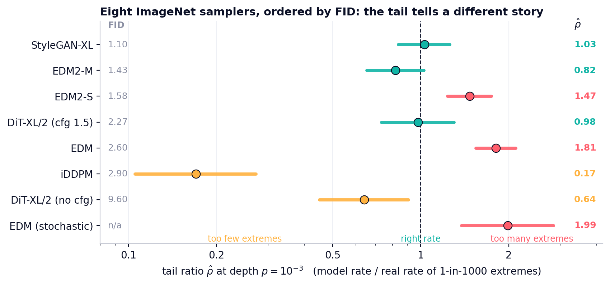
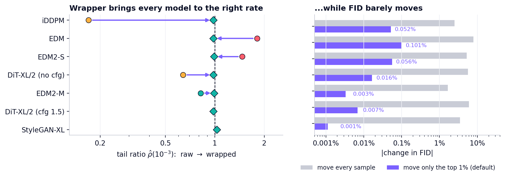
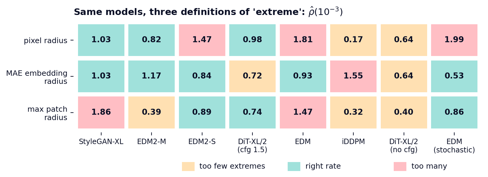
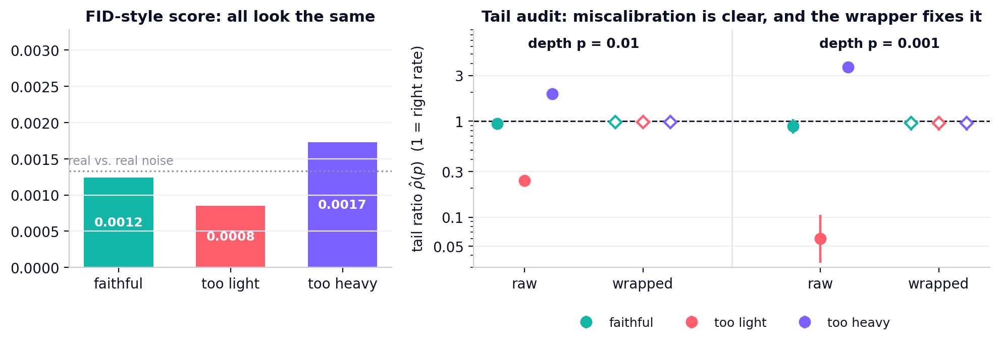
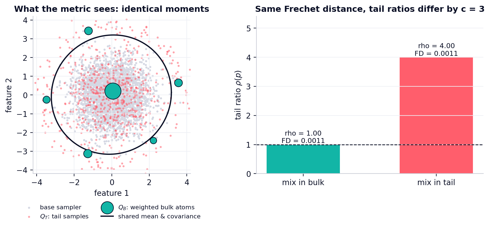
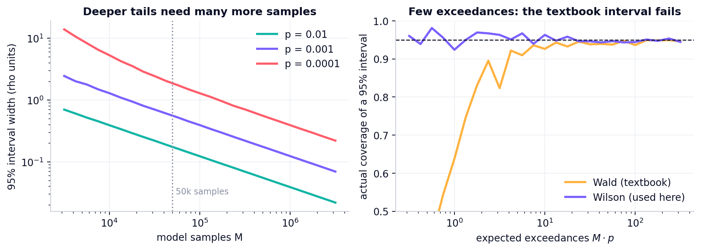
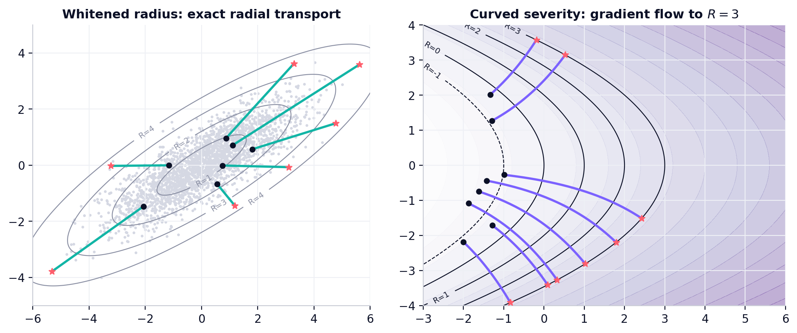

<p align="center">
  <picture>
    <source media="(prefers-color-scheme: dark)" srcset="assets/logo/banner_dark.png">
    
  </picture>
</p>

<p align="center">
  <b>Is your generator producing the right number of extremes? Measure it, then fix it, without retraining.</b>
</p>

<p align="center">
  <a href="https://github.com/ziwaa-se/rarecal/actions/workflows/tests.yml"></a>
  
  <a href="LICENSE"></a>
  <a href="https://ziwaa-se.github.io/rarecal/"></a>
</p>

<p align="center">
  <a href="#-results-at-a-glance">Results</a> ·
  <a href="#-quickstart">Quickstart</a> ·
  <a href="#-how-it-works">How it works</a> ·
  <a href="#-examples">Examples</a> ·
  <a href="#-reproducing-the-study">Reproduce</a>
</p>

---

FID, KID, FD-DINOv2 and precision/recall summarize the **bulk** of a distribution. The
samples that matter most in safety checks, stress tests and data augmentation are the
**rare** ones, the 1-in-1,000 or 1-in-10,000 extremes, and these scores cannot see how often
a model makes them. Two samplers can have the same FID and differ by any factor in their
rate of extremes.

**RareCal** is a small, dependency-light toolkit that

1. **audits** a black-box sampler: *"how many more (or fewer) extremes does it produce than
   real data, at depth 1e-2, 1e-3, 1e-4?"*, with intervals that stay valid when only a handful
   of extremes are observed;
2. **repairs** it: a post-hoc wrapper that moves about 1% of the samples so the rate of
   extremes matches the data, needs no weights or gradients, and leaves FID essentially
   unchanged.

## ✨ Results at a glance

Eight public ImageNet samplers (GAN, pixel diffusion, latent diffusion), 15k to 100k samples
each, audited against 1.08 million held-out real images on a common 32×32 grid:

<p align="center"></p>
<p align="center"><sub>FID: the value published by each model's authors on its own benchmark. Bars: 95% intervals
that include the error of the real threshold. Severity: whitened pixel radius.</sub></p>

| | |
|---|---|
| **11.7×** | spread in the rate of 1-in-1,000 extremes across the eight samplers (ρ̂ = 0.17 to 1.99); only 3 of 8 have an interval that covers the real rate |
| **no rank link** | between published FID and the tail ratio (Spearman −0.43, p = 0.34): a better FID does not mean better-calibrated extremes |
| **25 / 32** | tests find generated extremes *less varied* than real extremes (Brown–Forsythe, Holm-corrected; 28/32 with a permutation test) |
| **≤ 1%** | of samples moved by the wrapper, which brings all seven samplers in the wrapping study to ρ̂ ∈ [0.98, 1.03] |
| **≤ 0.1%** | change in FID after wrapping (moving every sample instead changes FID by up to 7.9%) |
| **5.6×** | too many 1-in-1,000 extremes for a DDPM on CelebA-HQ 256, while StyleGAN2-ADA is on target (ρ̂ = 0.95) |
| **3,238** | draws that *any* test needs before it can tell ρ = 1 from ρ = 2 at depth 10⁻⁴ (information-theoretic lower bound) |

<table>
<tr>
<td width="50%"></td>
<td width="50%"></td>
</tr>
<tr>
<td><b>Repair.</b> The wrapper moves each sampler to the right rate of extremes (left) at a
negligible cost in FID (right, log scale).</td>
<td><b>"Extreme" is a choice.</b> Pixel-space, embedding-space and worst-patch definitions
rank the same models differently, so the audit reports the definition it uses.</td>
</tr>
</table>

## 🚀 Quickstart

```bash
git clone https://github.com/ziwaa-se/rarecal.git
cd rarecal
pip install --upgrade pip           # editable installs need pip >= 21.3
pip install -e ".[examples]"        # numpy + scipy; matplotlib/pandas for the examples
python examples/01_quickstart.py    # about 25 s on a laptop CPU
```

```python
import rarecal as rc

# 1. define "extreme" and fit the calibration law, on real data only
sev = rc.WhitenedRadius(n_components=50).fit(real_calib)          # arrays of shape (n, d)
law = rc.CalibrationLaw.fit(sev(real_calib))    # empirical bulk + generalized-Pareto tail

# 2. audit a sampler against held-out real data
print(rc.audit(sev(samples), sev(real_heldout), depths=[1e-2, 1e-3]))

# 3. repair it (no weights, no gradients, no retraining)
wrapped = rc.Wrapper(sev, law, tail_only=0.99)(samples)
print(rc.audit(sev(wrapped), sev(real_heldout), depths=[1e-2, 1e-3]))
```

Output for a sampler whose tail is too heavy, from `examples/01_quickstart.py`:

```text
=== too heavy:  Frechet distance 0.0017          (real-vs-real noise floor: 0.0013)
       p     tau_p       k        M  rho_hat       95% interval  verdict
   1e-02     8.148    3865   200000     1.93  [  1.85,   2.02]  over
   1e-03    11.423     737   200000     3.68  [  3.24,   4.14]  over
--- after wrapping (2% of samples moved)
   1e-02     8.148    1956   200000     0.98  [  0.93,   1.03]  calibrated
   1e-03    11.423     192   200000     0.96  [  0.80,   1.13]  calibrated
```

<p align="center"></p>

The same workflow runs from the command line on `.npy` files of any shape:

```bash
rarecal audit --calibration real_a.npy --reference real_b.npy --model samples.npy --depths 1e-2 1e-3
rarecal wrap  --calibration real_a.npy --model samples.npy --out wrapped.npy --box 0 255
```

## 🧭 How it works

```text
 real data ──► severity R(x) ──► calibration law F̂  (empirical bulk + GPD tail, threshold chosen by KS fit)
                    │                                   │
 model samples ─────┤                                   │
                    ▼                                   ▼
   AUDIT   ρ̂(p) = #{R(x_i) ≥ τ_p} / (M·p)      REPAIR  rank r_i → v_i → target F̂⁻¹(v_i)
           Wilson interval, widened for the            move x_i to its target severity along
           error in the real threshold τ_p             a shape-preserving transport
           verdict: under / calibrated / over          (only the top 1% of ranks move)
```

* **Severity** `R(x)` says how extreme a sample is. The default is the whitened PCA radius
  (a Mahalanobis distance); `MaxPatchRadius` scores the most unusual image patch, and any
  function of your own (for example the radius in a pretrained embedding) works as well.
* **Tail ratio** `ρ(p) = Q{R ≥ τ_p} / P{R ≥ τ_p}`, where `τ_p` is the real `(1−p)`-quantile.
  `ρ = 1` is the right rate; `ρ = 3` means three times too many extremes.
* **Intervals.** At depth 10⁻⁴ a 50k sample set has about 5 exceedances, where the textbook
  Wald interval covers the truth far less often than 95%. RareCal uses the Wilson interval,
  adds the uncertainty of the real threshold in quadrature, and cross-checks with
  Clopper–Pearson when one or no exceedance is seen.
* **Calibration law.** Real data are finite too, so the target law is spliced: empirical below
  a threshold `u`, generalized Pareto above it, with `u` picked by a Kolmogorov–Smirnov fit score.
* **Wrapper.** Sort the M samples by severity, give each the matching quantile of the
  calibration law, and move it there. For the whitened radius the move is an exact radial
  rescaling (direction kept); for any differentiable severity, `rc.gradient_flow` and
  `rc.minimal_displacement` provide the move, and with the whitening metric both reduce to
  the same radial rescaling (checked in `tests/test_transport.py`).

<details>
<summary><b>Why can FID not see this? (a two-line argument)</b></summary>

A Fréchet distance depends on a sampler only through the mean and covariance of its features.
Take the real distribution, replace a fraction ε = c·p of it by either its own tail or by a
set of bulk samples reweighted to have the tail's feature mean and covariance: both mixtures
have *identical* feature moments, hence identical FID, but their tail ratios differ by exactly
`c`. `examples/02_blind_spot.py` builds this pair explicitly:

<p align="center"></p>
</details>

## 📚 Examples

| Script | What it shows | Figure |
|---|---|---|
| [`01_quickstart.py`](examples/01_quickstart.py) | three samplers with identical mean/covariance: FID-style scores cannot separate them, the audit does, the wrapper fixes both miscalibrated ones | [quickstart](assets/figures/quickstart.png) |
| [`02_blind_spot.py`](examples/02_blind_spot.py) | the exact construction of two samplers with the same Fréchet distance and a 3× different tail ratio | [blind_spot](assets/figures/blind_spot.png) |
| [`03_sample_budget.py`](examples/03_sample_budget.py) | interval width versus sample size at three depths; Wald versus Wilson coverage when exceedances are few; the sample-size lower bound | [sample_budget](assets/figures/sample_budget.png) |
| [`04_transports.py`](examples/04_transports.py) | moving samples to a target severity: exact radial transport, and gradient flow for a curved severity | [transports](assets/figures/transports.png) |
| [`05_cli.sh`](examples/05_cli.sh) | the command-line workflow on `.npy` files | – |
| [`scripts/make_results_figures.py`](scripts/make_results_figures.py) | all real-model figures of this README, from the CSVs in `results/` | – |

<p align="center">
  
  
</p>

## 🔬 Reproducing the study

| Level | What you need | Command | Time |
|---|---|---|---|
| **1. Library and theory** | CPU | `pytest -q` and `python examples/0*.py` | < 1 min |
| **2. Every figure and number** | CPU, the CSVs in [`results/`](results) | `python scripts/make_results_figures.py`, `python reproduce/figures/make_figures.py` | < 1 min |
| **3. Full pipeline** | GPUs, public checkpoints, ImageNet / CelebA-HQ | scripts in [`reproduce/`](reproduce) | days |

Every number in the table above is printed by `scripts/make_results_figures.py` from the
result files. The full pipeline (sampling from public checkpoints, severity functionals,
validation, wrapping and FID) is documented in [`reproduce/README.md`](reproduce/README.md).

Validation included in `results/`: 400 real-versus-real re-splits (the threshold-aware interval
covers ρ = 1 in 95.0–95.8% of them), planted ratios from 0.3 to 5, sensitivity to every
analysis setting, component ablations, and a second seed of the shape test.

## 🗂️ Repository layout

```text
rarecal/        the library (numpy + scipy only)
  severity.py     WhitenedRadius, MaxPatchRadius and their transports
  calibration.py  CalibrationLaw: empirical bulk + generalized-Pareto tail
  intervals.py    Wald, Wilson, Clopper-Pearson, threshold-error quadrature
  audit.py        audit() -> AuditReport with verdicts
  wrap.py         Wrapper: rank remap + transport
  transport.py    gradient flow and minimal-displacement transports
  theory.py       Frechet distance, sample-size lower bound, FID cost bound
  cli.py          `rarecal audit` / `rarecal wrap`
examples/       five runnable demos
tests/          unit tests, including the theory checks
results/        CSV result files of the real-model study
reproduce/      full experiment pipeline (sampling, audits, validation, wrapping, FID)
scripts/        README figures and logo
docs/           project page (GitHub Pages)
```

## Citing

If you use RareCal, please cite the software (see [`CITATION.cff`](CITATION.cff)):

```bibtex
@software{rarecal2026,
  author  = {{The RareCal developers}},
  title   = {RareCal: auditing and repairing the rare-event rates of generative models},
  year    = {2026},
  url     = {https://github.com/ziwaa-se/rarecal}
}
```

## License

MIT, see [LICENSE](LICENSE). The pretrained generators used in `reproduce/` are distributed
by their authors under their own licenses.
